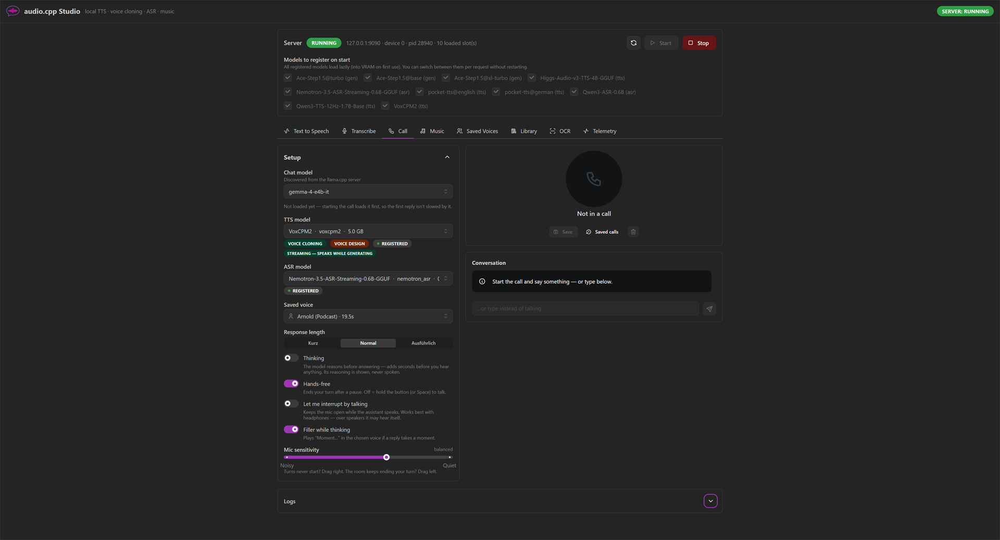

# audio.cpp Studio

A local **desktop app** (and browser app) for [audio.cpp](https://github.com/0xShug0/audio.cpp): generate **TTS**, **clone a voice** from an uploaded clip **or a live mic recording**, **transcribe** audio, video or the microphone (ASR), hold a **spoken conversation** with a local chat model in that cloned voice, **generate music** from a one-line idea, run **page-photo OCR**, keep a **library of readings**, and **start/stop** the inference server — from a native window or your browser. It's also the backend for the [Android companion app](https://github.com/CaptainArni/audiocpp-android).



## Architecture

```
pywebview window ──or── browser ──or── Android companion app
        │  (loads SPA / REST, calls /api/*)
        ▼
FastAPI backend (uvicorn, :8110)   ← this repo; serves the built React SPA + /api/*
        │  spawns / proxies
        ├──────▶ audiocpp_server.exe (CUDA, :9090)   TTS · voice cloning · ASR · music
        └──────▶ llama.cpp server     (:8080)        vision OCR · chat · music prompts
```

The FastAPI backend serves the built React/Mantine frontend **and** manages `audiocpp_server`: it scans the models directory, generates `server.json` (lazy multi-model), spawns/stops the process, streams its logs (SSE), saves uploaded reference clips, and proxies TTS/ASR/music. It **proxies OCR and chat** to a separately-run `llama.cpp` server, stores **saved readings, conversations and music takes**, and exposes **telemetry**. Model selection switches per request without a restart.

Only `audiocpp_server` is started and stopped by Studio; the `llama.cpp` server runs separately (e.g. under llama-swap). Both hold models in VRAM once loaded, and on a single GPU they compete — the **Free VRAM** menu in the header is the one place that can see and release both.

```
audiocpp-ui/
  frontend/        React + Mantine (Vite)         → built into backend/static
  backend/         FastAPI app + desktop/browser entrypoints
    main.py          FastAPI: /api/* + SPA serving
    desktop_app.py   pywebview native window
    browser_app.py   opens default browser
    ocr.py           page-photo OCR via llama.cpp (model profiles)
    chat.py          streaming chat for the Call tab
    speakable.py     strips markdown/code so TTS reads prose, not asterisks
    music.py         music requests + the take store
    music_prompt.py  one-line idea → caption/lyrics/metadata via llama.cpp
    vram.py          free VRAM across both inference servers
    media.py         ffmpeg: probe / extract audio from video
    metrics.py       in-memory telemetry store
    config.py catalog.py models.py serverjson.py process.py proxy.py
    requirements.txt
  config.toml      settings (ports, paths, OCR model profiles)
  scripts/build.bat
  .vscode/         tasks.json + launch.json
```

## Prerequisites

- Windows with the **WebView2 runtime** (preinstalled on Windows 11).
- `audiocpp_server.exe` built (CUDA preset) and at least one downloaded model — see `config.toml`.
- Python 3.11+ and Node.js 18+.
- *(Optional, for OCR)* a `llama.cpp` server running a vision/OCR model — see the `[llama]` section of `config.toml`.

## First-time setup

```powershell
cd audiocpp-ui
copy config.example.toml config.toml    # then edit paths / OCR models for your machine
python -m venv .venv
.\.venv\Scripts\python -m pip install -r backend\requirements.txt
.\scripts\build.bat          # installs frontend deps, builds, copies to backend/static
```

`config.toml` is **gitignored** (it holds machine-specific paths); `config.example.toml` is the committed template. A `data/config.toml` (also gitignored) overrides the root file if present.

## Run

From **VS Code**: open this folder and run a task (Terminal → Run Task) — **Build Frontend**, **Launch Desktop**, **Launch Browser**, or the combined **Build + Launch Desktop**.

From a terminal:

```powershell
# native desktop window
.\.venv\Scripts\python backend\desktop_app.py

# or in your default browser
.\.venv\Scripts\python backend\browser_app.py
```

Both serve at `http://127.0.0.1:8110`. Tabs: **Text to Speech**, **Transcribe**, **Call**, **Music**, **Saved Voices**, **Library**, **OCR**, **Telemetry**. Click **Start** to launch the inference server.

For video transcription, `ffmpeg` must be on `PATH` (or set `[media].ffmpeg` in `config.toml`). Everything else works without it.

## Dev workflow (hot reload)

Run the backend and the Vite dev server separately:

```powershell
# terminal 1 — API with auto-reload (VS Code: "Python Debugger: FastAPI")
.\.venv\Scripts\python -m uvicorn main:app --reload   # cwd: backend

# terminal 2 — Vite dev server (proxies /api → :8110)
cd frontend && npm run dev                            # open http://localhost:5173
```

The frontend build (`vite build`) does **not** type-check — run `cd frontend; npx tsc --noEmit` before building.

## Configuration (`config.toml`)

```toml
[server]                     # the FastAPI app that serves this UI
host = "0.0.0.0"             # 0.0.0.0 so the Android app can reach it on the LAN
port = 8110

[audiocpp]                   # the audio.cpp server this app launches and controls
exe = "E:/LLM/audio/audio.cpp/build/windows-cuda-release/bin/audiocpp_server.exe"
models_dir = "E:/LLM/audio/audio.cpp/models"
host = "127.0.0.1"
port = 9090

[llama]                      # external llama.cpp vision server for OCR (not launched here)
host = "127.0.0.1"
port = 8080
default_ocr_model = "paddleocr-vl-1-6-gguf"

# One [[llama.ocr_model]] per selectable OCR model. `model` is the name llama.cpp
# knows it by; the prompt + request-shaping differ per family (PaddleOCR-VL wants
# the literal prompt "OCR:"; Gemma wants an instruction prompt with thinking off).
[[llama.ocr_model]]
id = "paddleocr-vl-1-6-gguf"
label = "PaddleOCR-VL 1.6"
model = "paddleocr-vl-1-6-gguf"
prompt = "OCR:"

[call]                       # the Call tab. Chat models are NOT listed here —
                             # they are discovered from llama.cpp's /v1/models.
default_chat_model = "gemma-4-e4b-it-ud-q8-k-xl"
default_tts_model = "VoxCPM2"
default_asr_model = "Nemotron-3.5-ASR-Streaming-0.6B-GGUF"
thinking_tokens = 900        # extra budget when thinking is on (it shares max_tokens)
system_prompt = """…answer in spoken language, no markdown…"""

[[call.length]]              # one per response-length preset
id = "brief"
label = "Kurz"
max_tokens = 140
instruction = "Fasse dich sehr kurz: ein bis zwei Sätze."

[music]                      # the Music tab
default_model = "Ace-Step1.5@turbo"
max_takes = 4
default_duration_sec = 45
timeout_sec = 900

# Prompt enhancement is bound to the music model's *family*, not to an id the
# client picks, so choosing an ACE-Step model brings ACE-Step's prompting rules
# with it. The reply is strict JSON — caption, lyrics, title, BPM, key, time
# signature — because a prettier paragraph still leaves every field to fill in.
[[llama.music_prompt]]
id = "ace-step-default"
family = "ace_step"
label = "ACE-Step"
model = ""                   # blank = whatever chat model you picked in the tab

[android]                    # optional: hand out the companion APK for side-loading
repo_dir = "E:/LLM/audio/audiocpp-android"
```

Copy `config.example.toml` → `config.toml` and edit `[audiocpp].exe`/`models_dir` and the OCR profiles for your machine. `config.toml` is gitignored; a `data/config.toml` (also gitignored) **overrides** the root file if present.

Optional icons: drop `icon_small.png` + `icon_large.png` in `backend/icons/` to brand the desktop window.

## Notes / limitations

- **Call** is a spoken conversation: talk into the mic, a `llama.cpp` model answers, and the answer is read back in the voice you picked (including a cloned one). Pick the chat model from a dropdown — the list is discovered from the `llama.cpp` server, so whatever it can serve shows up. **Thinking** is a switch (its reasoning is displayed but never spoken), and **response length** is a preset that sets both a token cap and the instruction that makes the answer actually end there.
  - Two models make it feel live: a **streaming-capable TTS** (VoxCPM2 — starts speaking while still generating) and a **streaming ASR** (`Nemotron-3.5-ASR-Streaming-0.6B-GGUF`, install with `python tools/model_manager_v2.py install nemotron_asr_q8_0`). Measured end to end: ~1.2 s from the end of your sentence to the first spoken word. Non-streaming models still work, just a second or two slower.
  - **Start call** warms all three models first (lazy loading makes the first request to each pay a full VRAM load) — that is why the first turn is not slow.
  - Hands-free by default; a pause ends your turn. Hold **Space** for push-to-talk instead, **Esc** interrupts. Letting the assistant be interrupted by your voice is opt-in and wants headphones — over speakers it can hear itself.
  - **Everything is adjustable mid-call** — model, voice, language, length, thinking, sensitivity. Nothing is locked while a call is up; changes that can only affect the *next* answer say so instead of appearing to do nothing.
  - **Mic sensitivity** is a slider. Turns never starting means drag right; the room ending your turn for you means drag left.
  - Conversations are **saved only when you press Save**, never automatically, and a saved one can be loaded and continued (also from the phone — the store is shared). Long calls say when the oldest turns stop being sent to the model.
  - If you ask for code, the block is **announced rather than read out** ("Codeblock ausgelassen"). This relies on the model fencing its code, so `[call].system_prompt` asks for ``` fences — do not change it to forbid code blocks, or the model writes bare code as prose and it is read out character by character.
- **Music** turns a one-line idea into a song with **ACE-Step 1.5**. **Enhance** sends the idea to a `llama.cpp` model and fills in caption, lyrics, title, BPM, key, time signature and length in one click — tempo and key must *not* live in the caption, which is exactly why the reply is structured fields rather than a paragraph. Everything stays editable, and Enhance keeps one **Undo**, because it overwrites hand-written lyrics.
  - **Takes**, not renders: ask for up to four at once and they arrive one at a time, so a failure on the fourth does not discard three good ones. Each take is stored with the complete request that produced it, so **Reproduce** and **Vary** work months later — the audio cannot be reverse-engineered and the caption is usually edited between attempts.
  - **The seed is resolved here, never left to the server.** audio.cpp rolls its own and does not report it back, so an omitted seed makes a take unreproducible. Pin it before tuning anything else, or a parameter change cannot be told apart from a different roll.
  - Model variants are separate entries (`Ace-Step1.5@turbo`, `@base`, `@xl-turbo`): ACE-Step selects its DiT with a *load* option, so each is registered as its own lazy model. Turbo is guidance-distilled, so the guidance field is disabled rather than offered as a dial that does nothing. **XL** is the larger DiT — [audio.cpp#235](https://github.com/0xShug0/audio.cpp/pull/235) — and appears only when that variant is installed.
  - Measured on an RTX 5090 with turbo: 45 s of music in ~9 s cold, **~3 s warm**; 180 s in ~17 s. Output is 48 kHz stereo, and a three-minute take is ~33 MB, so takes live in `backend/music/` rather than with the scratch TTS output.
- **Free VRAM** sits in the header, not on a tab, because the workflow it exists for spans tabs: free the audio models, write a prompt with a big chat model, free that, then generate. It lists only servers actually holding something and disappears when the GPU is clear.
- **The companion APK can be downloaded from Studio itself** (Telemetry tab) when `[android].repo_dir` is set: open Studio on the phone and tap Download. Studio never *builds* the APK — it serves whatever Gradle last wrote and says how old it is.
- **Transcribe** can also **read the transcript back in any voice** (including a cloned one) once it has one — a model + voice picker and a chunked player sit under the result, so a recording can be replayed in a different voice without first saving it as a reading.
- **Transcribe** takes an audio file, a **video file** (its audio track is extracted on the PC with `ffmpeg`), or a **live mic recording**. Everything is converted to 16 kHz mono WAV — audio in the browser, video by the backend. Without `ffmpeg` on `PATH` (or `[media].ffmpeg` set) only WAV and browser-decodable audio work; the tab says so. Long media is capped by `[media].max_duration_sec` (1 h) since ASR is a single non-streaming request.
- In the desktop window the app auto-allows the microphone; in the browser you get the normal one-time prompt.
- `backend/uploads/` is scratch and is pruned after `[media].uploads_retention_hours` (24 h) — extracted audio is ~115 MB per hour.
- `audiocpp_server` is **CUDA-only**. Most models run **offline** (one-shot requests); models the catalog marks `streaming` (VoxCPM2, Nemotron ASR) are registered `mode: "streaming"` and can additionally emit audio/transcript chunks as they are produced — they still answer ordinary requests unchanged, so this costs no extra VRAM. Lazy-loaded models stay in VRAM until you **Stop** the server (or close the app). Changing which models stream needs a server restart.
- **OCR** requires a separate `llama.cpp` server (it is *not* launched by Studio). The **OCR** tab is a test bench to compare models/prompts on a dropped image.
- **Telemetry** also has a per-model unload, alongside the header's Free VRAM. Models load on first use and are then held indefinitely, which is right for latency and awkward on a box also running a large chat model; unloading is safe because the next request reloads transparently.
- This is a **local, unauthenticated LAN tool** — do not expose the port beyond your own network. Generated audio, uploads, saved voices, readings, conversations, and music takes live under `backend/` and are **not** committed (see `.gitignore`).

## Troubleshooting

- **"Frontend not built"** — run `scripts\build.bat`.
- **"audiocpp_server not found"** — fix `[audiocpp] exe` in `config.toml`.
- **OCR errors / "OCR server unreachable"** — start your `llama.cpp` server and check `[llama]` host/port + model names.
- **Blank desktop window** — install/repair the WebView2 runtime.
- **Port in use** — change `[server] port` in `config.toml` (and the Vite proxy target in `frontend/vite.config.ts` for dev).
